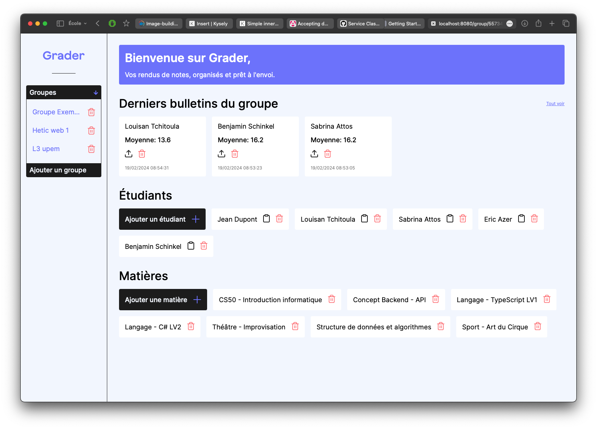

# Grader

## Table of contents

- [Contexte](#contexte)
- [Installation](#installation)
  - [Avec Docker](#avec-docker)
  - [Sans Docker](#sans-docker)
- [API Documentation](#api-documentation)
- [Infrastructure et architecture](#infrastructure-et-architecture)
  - [Ce que j'ai appris](#ce-que-jai-appris)
  - [Développement continu](#développement-continu)
- [Remerciement](#remerciement)
- [Ressources](#ressources)
- [Auteur](#auteur)

## Contexte

Grader est un projet réalisé en solo dans le cadre du cours d'API à HETIC. La consigne principale est de générer un PDF avec une API, le reste est du bonus.

L'application Grader vise à générer les bulletins de notes d'étudiants sous format PDF.



## Installation

### Avec Docker

```bash
make up-dev # ou make up-prod |
make logs-dev # ou make logs-prod

# Si make ne fonctionne pas en local (copiez les commandes depuis le fichier Makefile)
docker-compose --project-name grader_dev -f docker-compose.yml -f docker-compose.dev.yml up -d --build # ou docker-compose --project-name grader_prod up -d --build
```

### Sans Docker

```bash
# depuis la racine

# mettez en place la base de donnée
psql -U username -d database_name -a -f ./db_migrations/migrations_1_init_db.sql

# depuis la racine
cd server

# mettez en place le .env
echo "DATABASE_URL=<URL de votre database ici>" > .env

# installer les dépendances et lancer l'app
npm install && npm run build
npm run start:prod #ou start:dev

# depuis la racine
cd client
npm install && npm run build
npm run start
```

Interagissez avec l'api via `http://localhost:4001/api/`

Interagissez avec le client via `http://localhost:4200/` en dev ou `http://localhost:8080/` en prod

## API Documentation

Le fichier `./documentation/Grader-Louisan-tchitoula.postman_collection.json` peut être importé dans postman afin d'obtenir la collection d'endpoints de l'API et les tester !

## Infrastructure et architecture


### Ce que j'ai appris

Avec ces gros objectifs techniques, Grader m'a permis d'approfondir beaucoup d'aspects du développement d'application web.

#### DevOps

Le développement s'est déroulé entièrement sous conteneur.

J'ai pu appliquer des subtilités apprises dans la documentation comme le multi-stage building afin de créer des image de production ou de développement à partir d'unique Dockerfile par infrastructure.

#### Design Pattern (et 0.01% de la notion de 'Clean Code')

J'ai trouvé un intêret à intégrer dans mon code les patternes Singleton et
Builder (i.e: `router.abstract.ts`, `api-service.abstract.ts`, `validator.ts`).

Ces derniers mon permis d'écrire du code plus rapidement tout en le rendant plus robuste et consistente.

#### Nouvelle version d'Angular (17)

- Prise en main du nouveau paradigme (Angular promeut dorénavant un code plus déclaratif avec les `signal(), input(), inject()`)
- Nouvelle syntaxe de templating (`@if, @for, @empty`...).

J'ai aussi pris le temps de découvrir des points manquant dans mon bagage technique Angular :

- Les Guards de routes
- Les Reactive Forms
- RxJs (Surtout pour les `Subscription` et les `Subject`)

#### TypeScript

Pour un code maintenable et évolutif, j'ai du creuse dans de nouvelle notions découverte dans la documentation:

- L'héritage entre les interfaces
- Les interfaces de classes `abstract`
- Le typage générique
- Les Utility Types

### Développement continu

L'application est entièrement Dockerisée. Pour la suite, il sera intéressant d'y ajouter une couche d'authentifiaction et d'autorisation afin de la déployer.

Pistes :

- Vercel: hoster le backend et/ou infrastructure de base de donnée ? **A creuser**
- Scaleway: obtenir mon domaine et reprendre l'image nginx du côté client pour un déploiement léger et rapide
- Github Actions: pour l'automatisation du déploiement, puisque scaleway permet la connexion ssh vers le domaine build le container puis le `cp` dans l'environnement remote serait simple.

## Remerciement

Merci à Julien Heitz et Djédjé Gboble pour les code reviews, les sessions de tests et le partage de ressources durant le développement !

Djédjé Gboble :

- [LinkedIn](https://www.linkedin.com/in/djédjé-gboble-3100b1228/)
- [GitHub](https://github.com/Kobrae-San)

Julien Heitz :

- [LinkedIn](https://www.linkedin.com/in/heitzjulien/)
- [GitHub](https://github.com/heitzjulien)

## Ressources

- [Angular Documentation](https://angular.dev/overview)
- [PDFKit Documentation](http://pdfkit.org/docs/getting_started.html) & [PDFKit Table](https://github.com/natancabral/pdfkit-table/tree/main)
- [StackOverflow question: How to read Content-Dispotion from response Headers](https://stackoverflow.com/questions/42898162/how-to-read-content-disposition-headers-from-server-response-angular-2) ? (To get the filename of the generated PDF in my case)
- [This issue on Angular's repository](https://github.com/angular/angular/issues/18586), bug from 2017 but still to date lol
- [Docker's documentation](https://docs.docker.com/get-started/09_image_best/)

## Auteur

Louisan Tchitoula:

- [LinkedIn](https://www.linkedin.com/in/louisan-tchitoula/)
