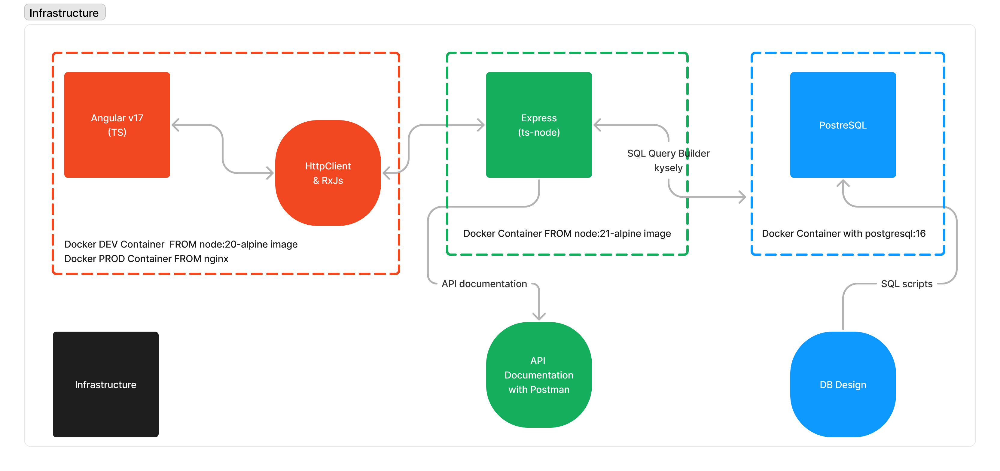

# Grader - HETIC

## Contexte

Grader est un projet réalisé dans le cadre du cours d'API à HETIC. La consigne principale est de générer un PDF avec une API, le reste est du bonus.

L'application Grader vise à générer les bulletins de notes d'étudiants sous format PDF.

## Installation

### Avec Docker

```bash
make up-dev # ou make up-prod
make logs
```

### Sans Docker

```bash
# depuis la racine
cd server

# mettez en place la base de donnée
psql -U username -d database_name -a -f ./db_migrations/migrations_1_init_db.sql

# mettez en place le .env
echo "DATABASE_URL=<URL de votre database ici>" > .env

# installer les dépendances et lancer l'app
npm install && npm run build
npm run start:prod #ou start:dev

# depuis la racine
cd client
npm install && npm run build
npm run start
```

Interagissez avec l'api via `http://localhost:4001/api/` | Le fichier `./documentation/Grader-Louisan-tchitoula.postman_collection.json` peut être importé dans postman afin de tester les endpoints de l'API ou lu en tant que documentation !

Interagissez avec le client via `http://localhost:4200/` en dev ou `http://localhost:8080/` en prod

## Infrastructure et architecture



## Useful resources

- [Angular Documentation](https://angular.dev/overview)
- [PDFKit Documentation](http://pdfkit.org/docs/getting_started.html) & [PDFKit Table](https://github.com/natancabral/pdfkit-table/tree/main)
- [StackOverflow question: How to read Content-Dispotion from response Headers](https://stackoverflow.com/questions/42898162/how-to-read-content-disposition-headers-from-server-response-angular-2) ? (To get the filename in my case)
- [This issue on Angular's repository](https://github.com/angular/angular/issues/18586), bug from 2017 but still to date lol
- [Docker's documentation](https://docs.docker.com/get-started/09_image_best/)
